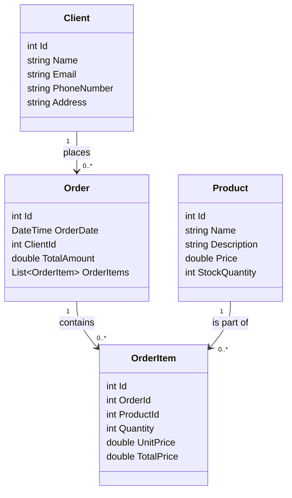
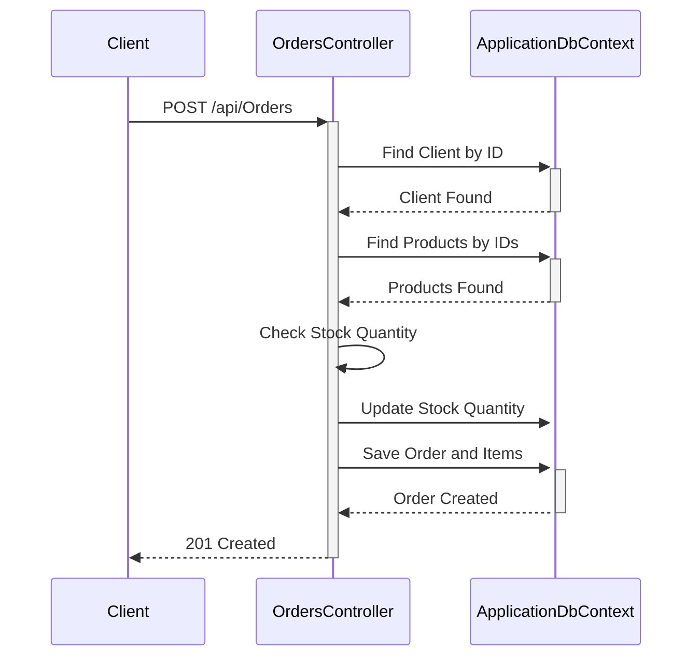

# ProjetoFinalPos

## Descrição

Este projeto é uma API para gerenciar clientes, produtos, pedidos e itens de pedidos. A API é construída usando ASP.NET Core e Entity Framework Core.

## Diagrama de Classes

## Diagrama de Sequência

## Endpoints

### ClientsController

1. **GET: api/Clients**
   - **Descrição:** Recupera todos os clientes.
   - **Resposta de Sucesso:** `200 OK` com a lista de clientes.
   - **Resposta de Erro:** `204 No Content` se não houver clientes.

2. **GET: api/Clients/{id}**
   - **Descrição:** Recupera um cliente específico pelo ID.
   - **Parâmetros:**
     - `id` (int): O ID do cliente a ser recuperado.
   - **Resposta de Sucesso:** `200 OK` com o cliente especificado.
   - **Resposta de Erro:** `404 Not Found` se o cliente não for encontrado.

3. **PUT: api/Clients/{id}**
   - **Descrição:** Atualiza um cliente existente.
   - **Parâmetros:**
     - `id` (int): O ID do cliente a ser atualizado.
     - `client` (Client): O objeto de cliente atualizado.
   - **Resposta de Sucesso:** `204 No Content` se o cliente for atualizado com sucesso.
   - **Resposta de Erro:** 
     - `400 Bad Request` se o ID na URL não corresponder ao ID no objeto de cliente.
     - `404 Not Found` se o cliente não for encontrado.

4. **POST: api/Clients**
   - **Descrição:** Cria um novo cliente.
   - **Parâmetros:**
     - `client` (Client): O objeto de cliente a ser criado.
   - **Resposta de Sucesso:** `201 Created` com o cliente recém-criado.
   - **Resposta de Erro:** `400 Bad Request` se o objeto de cliente for inválido.

5. **DELETE: api/Clients/{id}**
   - **Descrição:** Exclui um cliente existente.
   - **Parâmetros:**
     - `id` (int): O ID do cliente a ser excluído.
   - **Resposta de Sucesso:** `204 No Content` se o cliente for excluído com sucesso.
   - **Resposta de Erro:** `404 Not Found` se o cliente não for encontrado.

### ProductsController

1. **GET: api/Products**
   - **Descrição:** Recupera todos os produtos.
   - **Resposta de Sucesso:** `200 OK` com a lista de produtos.
   - **Resposta de Erro:** `204 No Content` se não houver produtos.

2. **GET: api/Products/{id}**
   - **Descrição:** Recupera um produto específico pelo ID.
   - **Parâmetros:**
     - `id` (int): O ID do produto a ser recuperado.
   - **Resposta de Sucesso:** `200 OK` com o produto especificado.
   - **Resposta de Erro:** `404 Not Found` se o produto não for encontrado.

3. **PUT: api/Products/{id}**
   - **Descrição:** Atualiza um produto existente.
   - **Parâmetros:**
     - `id` (int): O ID do produto a ser atualizado.
     - `product` (Product): O objeto de produto atualizado.
   - **Resposta de Sucesso:** `204 No Content` se o produto for atualizado com sucesso.
   - **Resposta de Erro:** 
     - `400 Bad Request` se o ID na URL não corresponder ao ID no objeto de produto.
     - `404 Not Found` se o produto não for encontrado.

4. **POST: api/Products**
   - **Descrição:** Cria um novo produto.
   - **Parâmetros:**
     - `product` (Product): O objeto de produto a ser criado.
   - **Resposta de Sucesso:** `201 Created` com o produto recém-criado.
   - **Resposta de Erro:** `400 Bad Request` se o objeto de produto for inválido.

5. **DELETE: api/Products/{id}**
   - **Descrição:** Exclui um produto existente.
   - **Parâmetros:**
     - `id` (int): O ID do produto a ser excluído.
   - **Resposta de Sucesso:** `204 No Content` se o produto for excluído com sucesso.
   - **Resposta de Erro:** `404 Not Found` se o produto não for encontrado.

### OrdersController

1. **GET: api/Orders**
   - **Descrição:** Recupera todos os pedidos.
   - **Resposta de Sucesso:** `200 OK` com a lista de pedidos.
   - **Resposta de Erro:** `204 No Content` se não houver pedidos.

2. **GET: api/Orders/{id}**
   - **Descrição:** Recupera um pedido específico pelo ID.
   - **Parâmetros:**
     - `id` (int): O ID do pedido a ser recuperado.
   - **Resposta de Sucesso:** `200 OK` com o pedido especificado.
   - **Resposta de Erro:** `404 Not Found` se o pedido não for encontrado.

3. **PUT: api/Orders/{id}**
   - **Descrição:** Atualiza um pedido existente.
   - **Parâmetros:**
     - `id` (int): O ID do pedido a ser atualizado.
     - `order` (Order): O objeto de pedido atualizado.
   - **Resposta de Sucesso:** `204 No Content` se o pedido for atualizado com sucesso.
   - **Resposta de Erro:** 
     - `400 Bad Request` se o ID na URL não corresponder ao ID no objeto de pedido.
     - `404 Not Found` se o pedido não for encontrado.

4. **POST: api/Orders**
   - **Descrição:** Cria um novo pedido.
   - **Parâmetros:**
     - `orderDto` (OrderDto): O objeto de transferência de dados do pedido contendo os detalhes do pedido.
   - **Resposta de Sucesso:** `201 Created` com o pedido recém-criado.
   - **Resposta de Erro:** 
     - `400 Bad Request` se o ID do cliente ou ID do produto for inválido, ou se não houver estoque suficiente.

5. **DELETE: api/Orders/{id}**
   - **Descrição:** Exclui um pedido existente.
   - **Parâmetros:**
     - `id` (int): O ID do pedido a ser excluído.
   - **Resposta de Sucesso:** `204 No Content` se o pedido for excluído com sucesso.
   - **Resposta de Erro:** `404 Not Found` se o pedido não for encontrado.

## Como Executar

1. Clone o repositório.
2. Navegue até o diretório do projeto.
3. Execute `dotnet restore` para restaurar as dependências.
4. Execute `dotnet ef database update` para aplicar as migrações e criar o banco de dados.
5. Execute `dotnet run` para iniciar a aplicação.

## Tecnologias Utilizadas

- ASP.NET Core
- Entity Framework Core
- SQLite
- Swagger para documentação da API

## Contribuição

Contribuições são bem-vindas! Sinta-se à vontade para abrir issues e pull requests.

## Licença

Este projeto está licenciado sob a licença MIT. Veja o arquivo [LICENSE](LICENSE) para mais detalhes.
